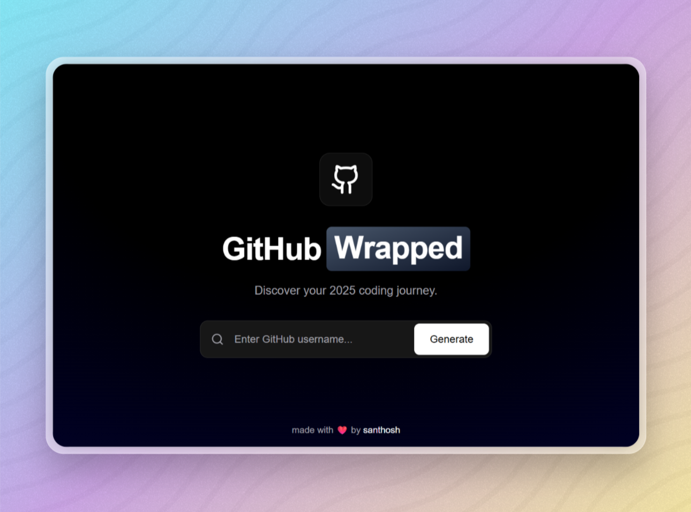

<div align="center">

# GitHub Wrapped 2025 🎉

### Your Year in Code, Beautifully Visualized ✨

[](https://warpify2025.vercel.app/)
[](https://reactjs.org/)
[](https://vitejs.dev/)
[](https://tailwindcss.com/)
[](https://nodejs.org/)

---



*Transform your GitHub activity into a stunning visual recap*

</div>

---

## ✨ Features

| Feature | Description |
|---------|-------------|
| 📊 **Comprehensive Stats** | Total contributions, commits, pull requests, issues, and more |
| 🏆 **Top Languages** | Discover your most-used programming languages of the year |
| 🔥 **Activity Insights** | Most active repositories and contribution patterns |
| 🎨 **Modern Bento Design** | Beautiful dark mode with glassmorphism and smooth gradients |
| 🖼️ **Image Export** | Download high-quality PNG to share on social media |
| 📱 **Fully Responsive** | Optimized for mobile, tablet, and desktop |
| ⚡ **Fast & Lightweight** | Built with Vite for blazing-fast performance |

---

## 🛠️ Tech Stack

<div align="center">

| Frontend | Backend |
|----------|---------|
| ⚛️ React 18 | 🟢 Node.js |
| ⚡ Vite | 🚀 Express |
| 🎨 TailwindCSS | 📡 GitHub GraphQL API |
| 🎬 Framer Motion 

</div>

---

## 🚀 Quick Start

### Prerequisites

- Node.js 18+ installed
- GitHub Personal Access Token ([Create one here](https://github.com/settings/tokens))

### Backend Setup

```bash
# Navigate to server directory
cd server

# Install dependencies
npm install

# Create environment file
echo "GITHUB_TOKEN=your_github_token_here" > .env

# Start development server
npm run dev
```

### Frontend Setup

```bash
# Navigate to client directory
cd client

# Install dependencies
npm install

# Start development server
npm run dev
```

🎉 **That's it!** Open [http://localhost:5173](http://localhost:5173) in your browser.

---

## 📁 Project Structure

```
github-wrapped-2025/
├── 📂 client/              # React frontend
│   ├── 📂 public/          # Static assets
│   └── 📂 src/             # Source files
│       ├── 📂 components/  # React components
│       └── 📂 pages/       # Page components
├── 📂 server/              # Express backend
│   └── 📂 routes/          # API routes
└── 📂 api/                 # Vercel serverless functions
```

---

## 🎨 Screenshots

<div align="center">

</div>

---

## 🤝 Contributing

Contributions are welcome! Feel free to:

1. Fork the repository
2. Create a feature branch (`git checkout -b feature/amazing-feature`)
3. Commit your changes (`git commit -m 'Add amazing feature'`)
4. Push to the branch (`git push origin feature/amazing-feature`)
5. Open a Pull Request

---

## 📄 License

This project is licensed under the **MIT License** - see the [LICENSE](LICENSE) file for details.

---

<div align="center">

**Made with ❤️ by [Santhosh](https://github.com/imsanthosh7)**

⭐ Star this repo if you found it helpful!

</div>
